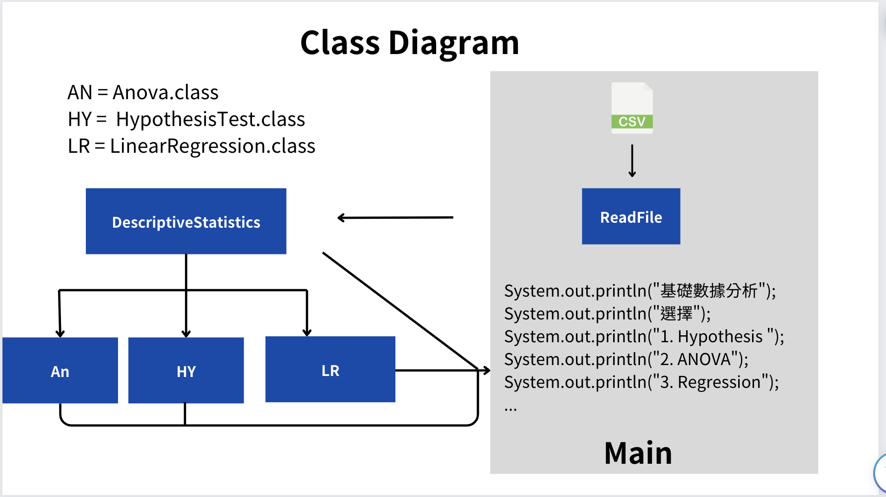

## 說明與動機

這是來自Java Project的說明文件，主要是為了方便使用者了解這個專案的功能，以及如何使用這個專案。

### About class

這個專案有5個class，分別是`ReadFile`、`DescriptiveStatistics`、`LinearRegression`、`Main`、`Anova`。

相信以下圖表勝於千言萬語，以下是這個專案的類別圖。



## DescriptiveStatistics 類別說明

**類別名稱：** `DescriptiveStatistics`

**類別說明：** 
這個類別提供了計算數據集描述性統計的方法，包括平均值、中位數、標準偏差等。

### Constructors

| 建構函數 | 描述 |
| --- | --- |
| `DescriptiveStatistics(double[] data, String name)` | 用指定的數據陣列和數據集名稱初始化 DescriptiveStatistics 實例。 |

### Methods

| 方法名 | 返回類型 | 描述 |
| --- | --- | --- |
| `getData()` | `double[]` | 返回當前數據集。 |
| `getName()` | `String` | 返回數據集的名稱。 |
| `setData(double[] data)` | `void` | 設置新的數據集。 |
| `setName(String name)` | `void` | 設置數據集的新名稱。 |
| `mean()` | `double` | 計算數據集的平均值。 |
| `median()` | `double` | 計算數據集的中位數。 |
| `standardDeviation()` | `double` | 計算數據集的標準偏差。 |
| `sampleSize()` | `int` | 返回數據集的樣本大小。 |
| `populationVariance()` | `double` | 計算數據集的總體方差。 |
| `populationStandardDeviation()` | `double` | 計算數據集的總體標準偏差。 |
| `summary()` | `String` | 提供數據集的描述性統計摘要。 |

### code

```{java}
import java.util.Arrays;

/**
 * DescriptiveStatistics 類別提供了計算數據集描述性統計的方法。
 * 這些統計包括平均值、中位數、標準偏差、樣本大小、母體方差和母體標準偏差。
 */
public class DescriptiveStatistics {

    private double[] data;
    private String name;

    /**
     * 使用指定的數據構造一個新的 DescriptiveStatistics 實例。
     *
     * @param data 要分析的雙精度值數組。
     * @param name 數據的名稱。
     */
    public DescriptiveStatistics(double[] data, String name) {
        this.data = data;
        this.name = name;
    }

    /**
     * 獲取當前數據集。
     *
     * @return 當前存儲的雙精度數組數據。
     */
    public double[] getData() {
        return data;
    }

    /**
     * 獲取數據集的名稱。
     *
     * @return 數據集的名稱字符串。
     */
    public String getName() {
        return name;
    }

    /**
     * 將數據集設置為指定的雙精度數組。
     *
     * @param data 新的數據集雙精度數組。
     */
    public void setData(double[] data) {
        this.data = data;
    }

    /**
     * 設置數據集的名稱。
     *
     * @param name 數據集的新名稱字符串。
     */
    public void setName(String name) {
        this.name = name;
    }

    /**
     * 計算數據集的平均值。
     *
     * @return 平均值的雙精度數值。
     */
    public double mean() {
        double sum = 0.0;
        for (double num : this.data) {
            sum += num;
        }
        return sum / this.data.length;
    }

    /**
     * 計算數據集的中位數。
     *
     * @return 中位數的雙精度數值。
     */
    public double median() {
        int size = this.data.length;
        double[] sortedData = Arrays.copyOf(this.data, size);
        Arrays.sort(sortedData);
        if (size % 2 == 0) {
            return (sortedData[size / 2 - 1] + sortedData[size / 2]) / 2.0;
        } else {
            return sortedData[size / 2];
        }
    }

    /**
     * 計算數據集的標準偏差。
     *
     * @return 標準偏差的雙精度數值。
     */
    public double standardDeviation() {
        double mean = mean();
        double sumOfSquares = 0.0;
        for (double num : this.data) {
            sumOfSquares += Math.pow(num - mean, 2);
        }
        return Math.sqrt(sumOfSquares / this.data.length);
    }

    /**
     * 計算數據集的樣本大小。
     *
     * @return 整數值，表示數據集中的樣本數量。
     */
    public int sampleSize() {
        return this.data.length;
    }

    /**
     * 計算數據集的母體方差。
     *
     * @return 母體方差的雙精度數值。
     */
    public double populationVariance() {
        double mean = mean();
        double sumOfSquares = 0.0;
        for (double num : this.data) {
            sumOfSquares += Math.pow(num - mean, 2);
        }
        return sumOfSquares / this.data.length;
    }

    /**
     * 計算數據集的母體標準偏差。
     *
     * @return 母體標準偏差的雙精度數值。
     */
    public double populationStandardDeviation() {
        return Math.sqrt(populationVariance());
    }

    /**
     * 提供數據集的描述性統計摘要。
     *
     * @return 描述數據集統計信息的字符串。
     */
    public String summary() {
        return "數據名稱: " + this.name + "\n平均值: " + mean() + "\n中位數: " + median() + "\n標準偏差: " + standardDeviation() + "\n樣本大小: " + sampleSize() + "\n母體方差: " + populationVariance() + "\n母體標準偏差: " + populationStandardDeviation();
    }

    /**
     * 提供數據集描述性統計分析的簡介。
     *
     * @return 描述數據集分析的字符串。
     */
    public String description() {
        return "以下將把每個數據集的數據進行描述性統計分析，包括平均值、中位數、標準(偏)差、樣本大小、母體方差和母體標準偏差。";     
    }

    /**
     * 講解數據集分析中使用的公式。
     *
     * @return 關於分析公式的解釋字符串。
     */
    public String explain(){
        return "以下為您講解公式\n"+ "平均值 = Σx / n\n" + "中位數 = (x[n/2] + x[n/2+1]) / 2\n" + "標準偏差 = √(Σ(x - x平均值)^2 / n)\n"  + "母體方差 = Σ(x - x平均值)^2 / n\n" + "母體標準偏差 = √(Σ(x - x平均值)^2 / n)\n";  
    }
}

```


\pagebreak

## LinearRegression 類別說明

**類別名稱：** `LinearRegression`

**繼承：** `DescriptiveStatistics`

**類別說明：** 
這個類別繼承自 `DescriptiveStatistics`，提供線性回歸分析的功能。它可以計算線性回歸模型的斜率和截距，並使用模型進行預測。

### Constructors

| 建構函數 | 描述 |
| --- | --- |
| `LinearRegression(double[] xData, double[] yData, String name)` | 使用自變量和因變量的數據，以及數據集的名稱來構造 LinearRegression 物件。 |

### Methods

| 方法名 | 返回類型 | 描述 |
| --- | --- | --- |
| `calculateSlope()` | `double` | 計算回歸線的斜率（beta）。 |
| `calculateIntercept()` | `double` | 計算回歸線的截距（alpha）。 |
| `predict(double x)` | `double` | 使用線性回歸模型預測給定 x 值的 y 值。 |
| `summary()` | `String` | 提供線性回歸模型的摘要。 |
| `explain()` | `String` | 提供線性回歸的基本概念和模型解釋。 |
| `description()` | `String` | 提供簡單線性回歸的詳細說明和公式。 |

### code

```{java}
import java.util.Arrays;

/**
 * LinearRegression 類繼承自 DescriptiveStatistics 類，提供線性回歸分析的功能。
 * 它能計算線性回歸模型的斜率和截距，並使用模型進行預測。
 */
public class LinearRegression extends DescriptiveStatistics {

    private double[] xData; // 自變量
    private double[] yData; // 因變量

    /**
     * 使用自變量和因變量的數據，以及數據集的名稱來構造 LinearRegression 物件。
     *
     * @param xData 自變量的數據陣列。
     * @param yData 因變量的數據陣列。
     * @param name 數據集的名稱。
     */
    public LinearRegression(double[] xData, double[] yData, String name) {
        super(yData, name); // 使用因變量初始化 DescriptiveStatistics
        this.xData = xData;
        this.yData = yData;
    }

    /**
     * 計算回歸線的斜率（beta）。
     * 
     * @return 斜率值。計算方法是將 xData 和 yData 的協方差除以 xData 的變異數。
     */
    public double calculateSlope() {
        double meanX = new DescriptiveStatistics(xData, "x").mean();
        double meanY = mean();
        double numerator = 0.0;
        double denominator = 0.0;

        for (int i = 0; i < xData.length; i++) {
            numerator += (xData[i] - meanX) * (yData[i] - meanY);
            denominator += Math.pow(xData[i] - meanX, 2);
        }

        return numerator / denominator;
    }

    /**
     * 計算回歸線的截距（alpha）。
     * 
     * @return 截距值。計算方法是 y 數據的平均值減去斜率乘以 x 數據的平均值。
     */
    public double calculateIntercept() {
        double meanX = new DescriptiveStatistics(xData, "x").mean();
        double meanY = mean();
        return meanY - calculateSlope() * meanX;
    }

    /**
     * 使用線性回歸模型預測給定 x 值的 y 值。
     *
     * @param x 自變量 x 的值。
     * @return 預測的 y 值。計算方法是截距加上斜率乘以 x。
     */
    public double predict(double x) {
        return calculateIntercept() + calculateSlope() * x;
    }

    /**
     * 提供線性回歸模型的摘要。
     *
     * @return 描述線性回歸模型的字符串，包括斜率、截距和回歸方程。
     */
    public String summary() {
        return "線性回歸模型 - " + getName() + "\n斜率 (beta0): " + calculateSlope() + "\n截距 (beta1): " + calculateIntercept() + "\n本數據的迴歸模型是: ŷ = " + calculateSlope() + "x + " + calculateIntercept();
    }
    
    /**
     * 提供線性回歸的基本概念和模型解釋。
     * 
     * @return 線性回歸的基本概念和模型解釋的字符串。
     */
    public String explain() {
        return "Statitical (True) Model is: y = f(x) + ε \n" +
               "其中： y = 應變數； x = 自變數 \n" +
               "Statitical (True) Model ----->  Fitted model , eg: ŷ = b1x + b0\n" +
               "利用 data 來尋找Ｙ和Ｘ的關係（不一定是因果關係）\n";
    }
    
    /**
     * 提供簡單線性回歸的詳細說明和公式。
     * 
     * @return 簡單線性回歸的詳細說明和公式的字符串。
     */
    public String description() {
        return "以下是簡單線性回歸的概念\n" +
               "=> involves one independent variable and one dependent variable.\n" +
               "Suppose: y = B0 + B1x + ε , then E(y) = B0 + B1x , ε~NID(0 , σ^2)\n" +
               "Sampling and Fitted : ŷ = b0 + b1x\n" +
               "Estimated: ŷ = b0 + b1x -----> E(y) = B0 + B1x\n" +
               "b0 -----> B0  ;  b1 -----> B1\n" +
               "(residual) e = y - ŷ  -----> ε = y - E(y)\n" +
               "by min Σ(y - ŷ)^2 = min Σ(y - b0 + b1x)^2\n" +
               "由 ∂SSE / ∂b0 = 0  and  ∂SSE / ∂b1 = 0\n" +
               "得 b1 = Σ(x - x̄)^2 (y - ȳ)^2 / Σ(x - x̄)^2\n" +
               "b0 = ȳ - b1x̄";
    }
}

```

\pagebreak

## Anova 類別說明

**類別名稱：** `Anova`

**繼承：** `DescriptiveStatistics`

**類別說明：** 
這個類別提供了執行單因素方差分析（ANOVA）的方法。用於分析多組數據集之間的均值是否存在顯著差異。

### Constructors

| 建構函數 | 描述 |
| --- | --- |
| `Anova(double[][] groups, String name)` | 使用多組數據構造 Anova 對象，每個子數組代表一組數據。 |

### Methods

| 方法名 | 返回類型 | 描述 |
| --- | --- | --- |
| `flatten(double[][] arrays)` | `double[]` | 將二維數組展平為一維數組。 |
| `overallMean()` | `double` | 計算總體均值。 |
| `totalSumOfSquares()` | `double` | 計算總體平方和（SST）。 |
| `betweenGroupSumOfSquares()` | `double` | 計算組間平方和（SSB）。 |
| `withinGroupSumOfSquares()` | `double` | 計算組內平方和（SSW）。 |
| `calculateFValue()` | `double` | 計算 ANOVA 的 F 值。 |
| `summary()` | `String` | 提供 ANOVA 分析的摘要。 |
| `explain()` | `String` | 提供 ANOVA 分析的基本概念和使用方法的解釋。 |
| `description()` | `String` | 提供 ANOVA 的詳細描述和公式。 |

### code

```{java}
import java.util.Arrays;

/**
 * Anova 類別提供了執行單因素方差分析（ANOVA）的方法。
 * 這個類別繼承自 DescriptiveStatistics，用於分析多組數據集之間的均值是否存在顯著差異。
 */
public class Anova extends DescriptiveStatistics {
    private double[][] groups;

    /**
     * 使用多組數據構造 Anova 對象。
     *
     * @param groups 二維數組，每個子數組代表一組數據。
     * @param name 數據集的名稱。
     */
    public Anova(double[][] groups, String name) {
        super(flatten(groups), name);
        this.groups = groups;
    }

    /**
     * 將二維數組展平為一維數組。
     *
     * @param arrays 要展平的二維數組。
     * @return 展平後的一維數組。
     */
    public static double[] flatten(double[][] arrays) {
        return Arrays.stream(arrays).flatMapToDouble(Arrays::stream).toArray();
    }

    /**
     * 計算總體均值。
     *
     * @return 總體均值。
     */
    public double overallMean() {
        return mean();
    }

    /**
     * 計算總體平方和（SST）。
     *
     * @return 總體平方和。
     */
    public double totalSumOfSquares() {
        double overallMean = overallMean();
        return Arrays.stream(this.getData()).map(x -> Math.pow(x - overallMean, 2)).sum();
    }

    /**
     * 計算組間平方和（SSB）。
     *
     * @return 組間平方和。
     */
    public double betweenGroupSumOfSquares() {
        double overallMean = overallMean();
        return Arrays.stream(groups).mapToDouble(group -> 
            group.length * Math.pow(new DescriptiveStatistics(group, "").mean() - overallMean, 2)
        ).sum();
    }

    /**
     * 計算組內平方和（SSW）。
     *
     * @return 組內平方和。
     */
    public double withinGroupSumOfSquares() {
        return totalSumOfSquares() - betweenGroupSumOfSquares();
    }

    /**
     * 提供 ANOVA 分析的摘要。
     *
     * @return 描述 ANOVA 分析結果的字符串。
     */
    public String summary() {
        return "ANOVA 分析 - " + getName() + "\n總體平方和 (SST): " + totalSumOfSquares() +
               "\n組間平方和 (SSB): " + betweenGroupSumOfSquares() +
               "\n組內平方和 (SSW): " + withinGroupSumOfSquares();
    }
    
    /**
     * 計算 ANOVA 的 F 值。
     * F 值是用於測量組間變異與組內變異的比率。
     *
     * @return F 統計量的值。
     */
    public double calculateFValue() {
        double ssb = betweenGroupSumOfSquares(); // 已計算的組間平方和
        double ssw = withinGroupSumOfSquares(); // 已計算的組內平方和
        int dfBetween = groups.length - 1; // 組間自由度
        int dfWithin = Arrays.stream(groups).mapToInt(arr -> arr.length).sum() - groups.length; // 組內自由度

        double msb = ssb / dfBetween; // 組間均方
        double msw = ssw / dfWithin; // 組內均方

        return msb / msw; // 計算 F 值
    }
    
    /**
     * 提供 ANOVA 分析的基本概念和使用方法的解釋。
     *
     * @return ANOVA 分析的基本概念和方法的字符串描述。
     */
    public String explain() {
        return "ANOVA (分析變異) 用於比較三個或更多組的平均數是否有顯著差異。" +
               "它將總變異分解為組間變異和組內變異，並通過 F 統計量來評估組間變異是否顯著大於組內變異。";
    }

    /**
     * 提供 ANOVA 的詳細描述和公式。
     *
     * @return ANOVA 的詳細描述和公式的字符串描述。
     */
    public String description() {
        return "ANOVA 通過計算 F 值來測試組間差異的顯著性。" +
               "F 值是組間均方 (MSB) 和組內均方 (MSW) 的比率，" +
               "其中 MSB = 組間平方和(SSB) / 組間自由度(dfBetween)，" +
               "MSW = 組內平方和(SSW) / 組內自由度(dfWithin)。" +
               "高 F 值通常表明組間變異顯著大於組內變異，從而指示組間存在顯著差異。";
    }
}
```


\pagebreak

## Tester

```{java}
import java.util.ArrayList;
import java.util.Arrays;
import java.util.Scanner;
import java.io.IOException;


public class Main {
        public static void main(String[] args) {
      
        //有可能會使用到兩種以上的資料集
        //所以用ArrayList來存放
        
        Scanner sc = new Scanner(System.in);
        ArrayList<DescriptiveStatistics> statsList = new ArrayList<>();
        
        System.out.println("請選擇數據來源 ? 1:CSV 2:手動輸入 3.使用範例");
        int choice1 = sc.nextInt();
        
        switch(choice1){
            case 1:
              System.out.println("輸入csv檔: ");
              String filePath = sc.next();
              ReadFile.readDataToStatsList(filePath, statsList);
              break;
            case 2:
              while (true) {
            
                    System.out.println("數據欄位名: ");
                    String name = sc.next();
                  
                    System.out.println("請問有幾個數據: ");
                    int n = sc.nextInt();
                    double[] data = new double[n];
        
                    System.out.println("輸入數據: ");
                    for (int i = 0; i < n; i++) {
                        data[i] = sc.nextDouble();
                    }
        
                    DescriptiveStatistics stats = new DescriptiveStatistics(data, name);
                    statsList.add(stats);
        
                    System.out.println("Do you want to enter another set of data? (Y/N)");
                    String answer = sc.next();
        
                    if (answer.equalsIgnoreCase("N")) {
                        break;
                    }
                }
              break;
            case 3:
              System.out.println("為您提供以下示範");
              double[] data1 = {1, 2, 3, 4, 5};
              double[] data2 = {2, 5 , 6, 7, 8};
              double[] data3 = {3, 4, 5, 6, 7};
              statsList.add(new DescriptiveStatistics(data1, "data1"));
              statsList.add(new DescriptiveStatistics(data2, "data2"));
              statsList.add(new DescriptiveStatistics(data3, "data3"));
              System.out.println("data1: " + Arrays.toString(data1));
              System.out.println("data2: " + Arrays.toString(data2));
              System.out.println("data3: " + Arrays.toString(data3));
              System.out.println("");
              System.out.println("--------------------------");
              System.out.println("");
              break;
        }
        
        System.out.println("基礎數據分析");
        System.out.println(statsList.get(0).description());
        for (DescriptiveStatistics stats : statsList) {
            System.out.println(stats.summary());
            System.out.println();
        }
        
        System.out.println(statsList.get(0).explain());
        System.out.println("--------------------------");
        System.out.println("");
        
        System.out.println("選擇要進行的分析：");
        System.out.println("1. Hypothesis Testing");
        System.out.println("2. ANOVA");
        System.out.println("3. Regression");
        int choice = sc.nextInt();
        System.out.println("");
        
        switch(choice){
            case 1:
              break;
            case 2:
              System.out.println("請選擇要做ANOVA的資料(輸入對應數字，輸入-1結束)：");
              for (int i = 0; i < statsList.size(); i++) {
                  System.out.println((i + 1) + ". " + statsList.get(i).getName());
              }
              
              ArrayList<Integer> indexList = new ArrayList<>();
              while(true) {
                  int index = sc.nextInt() - 1;
                  if (index == -2) {
                      break;
                  } else if (index >= 0 && index < statsList.size()) {
                      indexList.add(index);
                      System.out.println("已選擇 " + statsList.get(index).getName());
                  } else {
                      System.out.println("無效的索引，請重新輸入");
                  }
              }
              
              double[][] dataForAnova = new double[indexList.size()][];
              for (int i = 0; i < indexList.size(); i++) {
                  DescriptiveStatistics stats = statsList.get(indexList.get(i));
                  dataForAnova[i] = stats.getData();
              }
              
              if (dataForAnova.length > 1) {
                  Anova anova = new Anova(dataForAnova, "ANOVA Test");
                  System.out.println(anova.summary());
                  System.out.println("F 值: " + anova.calculateFValue());
              } else {
                  System.out.println("至少需要選擇兩組數據進行ANOVA分析");
              }
              break;
            case 3:
              //提供線性回歸的解釋
              System.out.println("要聽一下線性回歸的概念嗎？(Y/N)");
              String answer = sc.next();
              while(answer.equalsIgnoreCase("Y")){
                System.out.println("概念講解");
                double[] xData = {1, 2, 3, 4, 5};
                double[] yData = {2, 5 , 6, 7, 8};
                LinearRegression reg = new LinearRegression(xData, yData, "線性回歸示範");
                System.out.println(reg.description());
                System.out.println("要在聽一次嗎？(Y/N)");
                String answerl1 = sc.next();
                if (answerl1.equalsIgnoreCase("N")) {
                    System.out.println("好的，那我們進入實戰環節！");
                    System.out.println("");
                    break;
                }
                
              }
              for (int i = 0; i < statsList.size(); i++) {
                  System.out.println((i + 1) + ". " + statsList.get(i).getName());
              }
              System.out.println("請選擇要做迴歸分析的因變數：");
              int index1 = sc.nextInt() - 1;
              System.out.println("請選擇要做迴歸分析的自變數：");
              int index2 = sc.nextInt() - 1;
              String regName = statsList.get(index1).getName() + " vs. " + statsList.get(index2).getName();
              LinearRegression reg = new LinearRegression(statsList.get(index1).getData(), statsList.get(index2).getData(), regName);
              
              System.out.println("");
              System.out.println("迴歸分析結果：");
              System.out.println(reg.summary());
              System.out.println(reg.explain());
              System.out.println("--------------------------");
              System.out.println("");
              
              System.out.println("請問要預測 y(應變數) 值嗎？(Y/N)");
              String answerl2 = sc.next();
              while(answerl2.equalsIgnoreCase("Y")){
                System.out.println("請輸入 y 值：");
                double x = sc.nextDouble();
                System.out.println("預測的 x 值為：" + reg.predict(x));
                System.out.println("要在預測一次嗎？(Y/N)");
                String answerl3 = sc.next();
                if (answerl3.equalsIgnoreCase("N")) {
                    System.out.println("好的，再見！");
                    break;
                }
              }
            }
        sc.close();
    }
}
```

\pagebreak

## Example

1:使用範例+回歸分析

```r
請選擇數據來源 ? 1:CSV 2:手動輸入 3.使用範例
3
為您提供以下示範
data1: [1.0, 2.0, 3.0, 4.0, 5.0]
data2: [2.0, 5.0, 6.0, 7.0, 8.0]
data3: [3.0, 4.0, 5.0, 6.0, 7.0]

--------------------------

基礎數據分析
以下將把每個數據集的數據進行描述性統計分析，包括平均值、中位數、標準(偏)差、樣本大小、母體方差和母體標準偏差。
數據名稱: data1
平均值: 3.0
中位數: 3.0
標準偏差: 1.4142135623730951
樣本大小: 5
母體方差: 2.0
母體標準偏差: 1.4142135623730951

數據名稱: data2
平均值: 5.6
中位數: 6.0
標準偏差: 2.0591260281974
樣本大小: 5
母體方差: 4.24
母體標準偏差: 2.0591260281974

數據名稱: data3
平均值: 5.0
中位數: 5.0
標準偏差: 1.4142135623730951
樣本大小: 5
母體方差: 2.0
母體標準偏差: 1.4142135623730951

以下為您講解公式
平均值 = Σx / n
中位數 = (x[n/2] + x[n/2+1]) / 2
標準偏差 = √(Σ(x - x平均值)^2 / n)
母體方差 = Σ(x - x平均值)^2 / n
母體標準偏差 = √(Σ(x - x平均值)^2 / n)

--------------------------

選擇要進行的分析：
1. Hypothesis Testing
2. ANOVA
3. Regression
3

要聽一下線性回歸的概念嗎？(Y/N)
Y
概念講解
以下是簡單線性回歸的概念
=> involves one independent variable and one dependent variable.
Suppose: y = B0 + B1x + ε , then E(y) = B0 + B1x , ε~NID(0 , σ^2)
Sampling and Fitted : ŷ = b0 + b1x
Estimated: ŷ = b0 + b1x -----> E(y) = B0 + B1x
                          b0 -----> B0  ;  b1 -----> B1
         (redisual) e = y - ŷ  -----> ε = y - E(y)
                                by min Σ(y - ŷ)^2 = min Σ(y - b0 + b1x)^2
                                由 ∂SSE / ∂b0 = 0  and  ∂SSE / ∂b1 = 0
                                得 b1 = Σ(x - x̄)^2 (y - ȳ)^2 / Σ(x - x̄)^2
                                   b0 = ȳ - b1x̄
要在聽一次嗎？(Y/N)
N
好的，那我們進入實戰環節！

1. data1
2. data2
3. data3
請選擇要做迴歸分析的因變數：
1
請選擇要做迴歸分析的自變數：
2

迴歸分析結果：
線性回歸模型 - data1 vs. data2
斜率 (beta0): 1.4
截距 (beta1): 1.4000000000000004
本數據的迴歸模型是: ŷ = 1.4x + 1.4000000000000004
Statitical (True) Model is: y = f(x) + ε 
其中： y = 應變數  ； x = 自變數 
Statitical (True) Model ----->  Fitted model , eg: ŷ = b1x + b0
利用 data 來 尋找Ｙ和Ｘ的關係（不一定是因果關係）

--------------------------

請問要預測 y(應變數) 值嗎？(Y/N)
Y
請輸入 y 值：
100
預測的 x 值為：141.4
要在預測一次嗎？(Y/N)
N
好的，再見！

```

## 其他資料

**Github:** https://github.com/blingblingdong/Java_statistic

**Web App:** https://javashinyapp.fly.dev

**Presentation:** https://java.lsyverycute.com